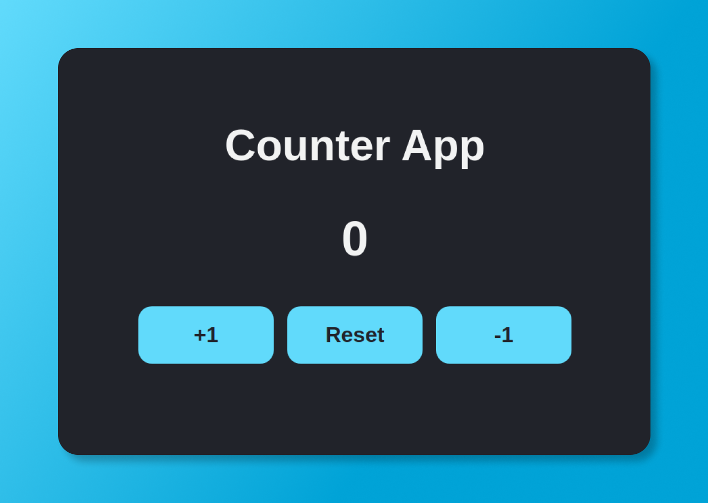

<h1 align="center">⚛️ Counter App</h1>
<p align="center">
  A simple counter app for learn ReactJS con typescript
</p>


## Demo

[Counter App](https://nikolam-dev.github.io/)

## Run Locally

Clone the project

```bash
  git@github.com:NikolaM-Dev/counter-tsx.git
```

Go to the project directory

```bash
  cd counter-tsx
```

Install dependencies

```bash
  yarn
```

Start the server

```bash
  # Development
  yarn start:dev

  # Build
  yarn build

  # Preview
  yarn preview
```

## ©️ Copyright

**`LICENSE`**: MIT

Check the file [here](./LICENSE)

<p align="center">⌨️ with ❤️ by <a href="https://github.com/NikolaM-Dev"><strong>NikolaM-Dev</strong><a></p>
